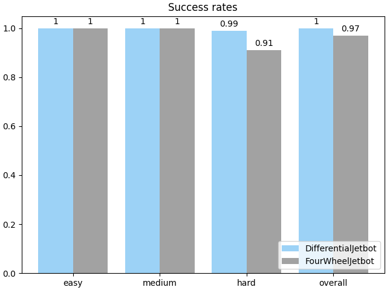

# End-To-End Reinforcement Learning Training of a Convolutional Neural Network to Achieve an Autonomous Driving Agent on Tracks in Simulation

The master's thesis deals with a self-driving agent in simulation. The agent is equipped with a single front facing camera and has to navigate through a series of goals. The work builds upon previous work at the [Scads.AI](https://scads.ai/).
The training process, reward functions and agent designs were changed following experimentation and research in reinforcement learning and autonomous driving.
The final agent was able to complete the parcours very reliably:

## Code

The code and installation instructions are stored in a seperate repository: [carsim-rl-cnn](https://github.com/geschnee/carsim-rl-cnn)