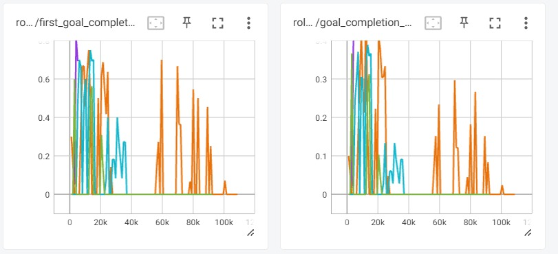
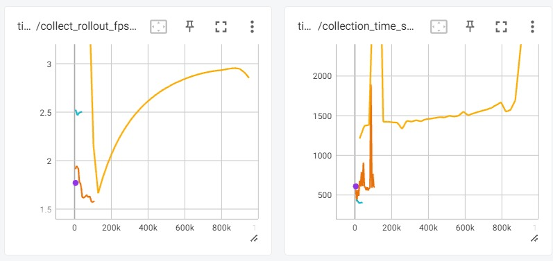
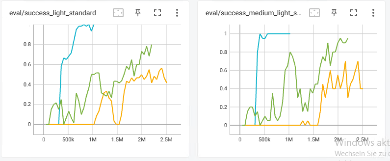
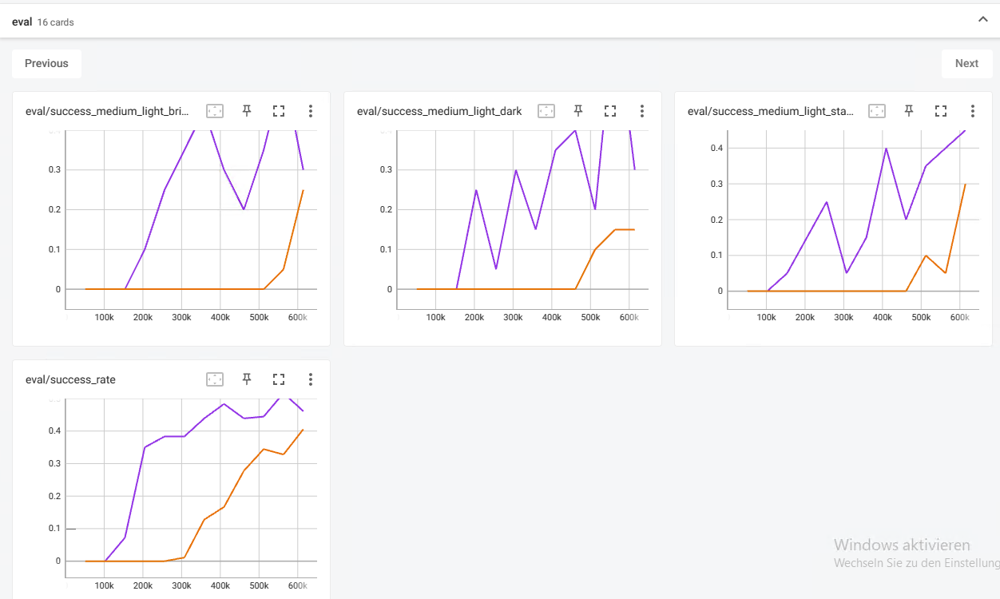
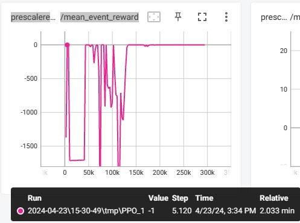
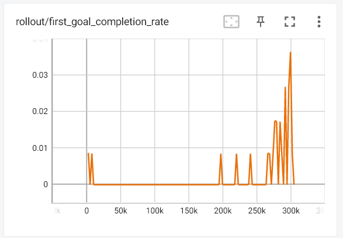
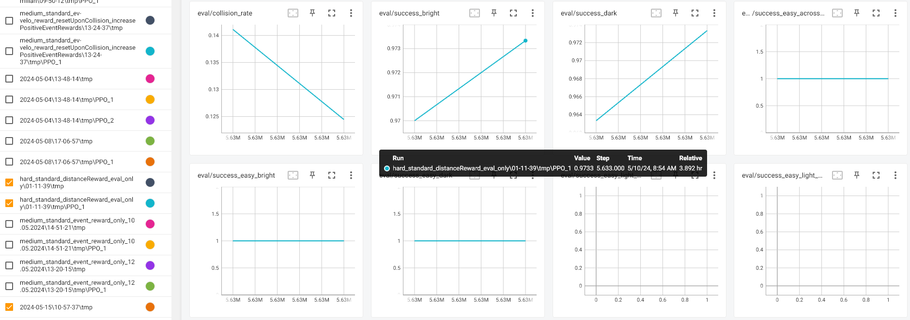
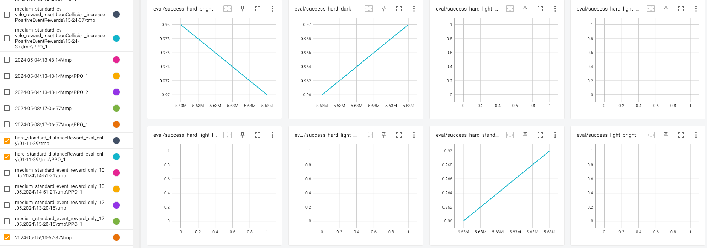
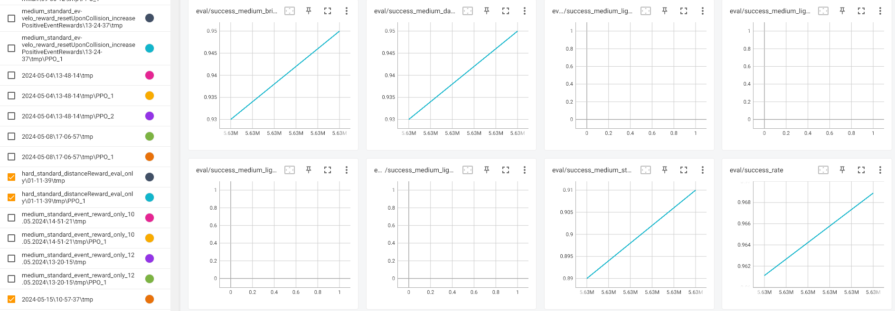

# 17.10.2023
* Erstmal nicht auf sim2reality Gap gehen
* Max hätte etwas zu wenig in die existierende Forschung geguckt
* gut wäre es in Simulation zu trainieren mit eigenen Verbesserungen und die Experimente von Max zu schlagen

# 24.10.2023

Hallo Georg,

mein Entwurf für die Forschungsfragen:

Frage 1. Mit welcher Erfolgsquote kann das Fahrzeug in der Simulation den
vollständigen Parkour bewältigen (Kollisionen sind als Negativereignisse
in der Reward-Funktion zu berücksichtigen). Die Metrik Erfolgsquote
berechnet das Verhältnis erfoglreich absolvierter Parkour-Fahrten zu
allen Parkour-Fahrten. Eine Begrennzung auf maximal 3 Mio
Trainingsschritte ist zu berücksichtigen (ist die Orientierung an dem
Wert aus der Arbeit von Max sinnvoll?)

Unterfrage: Eine Gedächtnisfunktion ist vorzuschlagen, zu implementieren und
zu evaluieren und dem Betrieb ohne Gedächtnisfunktion
gegenüberzustellen. Kann das LSTM in dem Anwendungsbereich einen Nutzen
bringen? Wenn ja/nein warum?

Frage 2. Kann das Fahrzeug in der Simulation bei unterschiedlichen
Lichtverhältnissen den Parkour erfolgreich bewältigen (Metrik
Erfolgsqoute), wenn für die Verarbeitung der Bilddaten ein CNN verwendet
wird.

Unterfrage: Es ist ein CNN auszuwählen, welches auf einem NVIDIA Jetson Nano
mit einer Bildsequenz von 30 Bilder je Sekunde die erforderlichen
Ausgangssignale verzögerungsfrei erzeugen kann.

Terminvorschlag: 8.11 um 15 Uhr.

Grüße Thomas

# 08.11.2023

- Experimente zur varying Motorpower können weggelassen werden
- Expose sollte vor dem Vortrag am 15.12. fertig sein
- Arbeit sollte auch angemeldet sein
- wie? ein Dokument vom Prüfungsamt ausdrucken, ausfüllen und an Thomas geben

TODO 
- Field of view für den Roboter prüfen
- Framerate prüfen

# 03.01.2024

- 1. Gespräch mit Martin Lorenz
- Termin Mittwoch alle 2 Wochen bit Thomas und Martin
- Thomas wird am Ende eine Note geben und Martin eine Bewertungsempfehlung an Rahm und dieser gibt dann eine Note
    - Ergebnis beider Noten ist dann das Endergebnis
- keine weiteren Gespräche mit Professor Rahm zusammen zu erwarten
- Martin hat sich mit RL in einer Grid-Umgebung beschäftigt (sb3)
- als nächstes Experimentierung mit Reward Function

Ziele bis nächstes Meeting:
- EventReward warum reward 100 für das letzte Tor?, warum nicht 1?
- kann der Agent mit Random Spawn und fixed spawn zuverlässig das erste Tor erreichen?
    - vielleicht weitwinkel Kamera input verwenden
- profiling um Training schneller zu machen

Ergbenisse Zwischenzeit:
- fixed spawn hat bis jetzt nur geradeausfahren gelernt
- random spawn ist nicht gut durch die Tore gefahren
- Maximilian hat random im Training und Fixed in der Bewertung genommen

- mehr Logging Metriken in Tensorboard
- Ausgliederung in Config Datei

- Zeit zwischen Schritten ist sehr gross, vielleicht deswegen nicht gut lernfähig

# 16.01.2024

## learn something
- zwischenstufe aus Fixed und Random Spawn
- Agent mit geringer zufälliger Rotation an festem Platz mit Orientierungsreward um zu lernen auf das erste Tor zu fahren

- Training auf einfachem Scenario mit fixiertem Spawnpoint und aber (weniger) zufälliger Rotation
    - Agent soll erstmal lernen durch das erste Tor zu fahren
    - Orientation Reward

### Ergebnisse

- neuer Parameter in Config: env_kwargs.spawn_point
    - Fixed, OrientationRandom, OrientationVeryRandom and FullyRandom
- eval_medium/success_rate von 95% mit spawn OrientationVeryRandom:
{'comment': 'now trying again with fixed spawn pos but fully 45 Degree random spawn orientation, can it still reach success rate of 1 for easy parcour?', 'n_envs': 10, 'num_evals_per_difficulty': 20, 'n_epochs': 5, 'log_interval': 5, 'batch_size': 64, 'n_steps': 64, 'copy_model_from': False, 'env_kwargs': {'jetbot': 'DifferentialJetBot', 'spawn_point': 'OrientationVeryRandom', 'single_goal': False, 'frame_stacking': 3, 'image_preprocessing': {'grayscale': True, 'equalize': True, 'contrast_increase': 'TODO', 'normalize_images': False}, 'coefficients': {'distanceCoefficient': 0.5, 'orientationCoefficient': 0.0, 'velocityCoefficient': 0.0, 'eventCoefficient': 1.0}, 'trainingMapType': 'randomEvalEasy', 'width': 500, 'height': 168}}
- print_states_after_reset.py shows that for OrientationVeryRandom the first goal in some medium and hard parcours is not fully in the camera field after reset
- print_states_after_reset.py shows that for OrientationRandom the first goal in some hard parcours is not fully in the camera field after reset

## Step time
- Zeit zwischen Schritten untersuchen, warum sind die Zeiten sehr lang?
    - time/fps Metrik?
    - mean_episode_length
    - geringe mean_episode_length --> Agent kann nicht reagieren/lernen
    - weniger Environments

### Ergebnisse

- kein Performance Unterschied zwischen Editor und Windows standalone festgestellt (auf Laptop)
- Editor ist schneller als Windows standalone auf dem Home PC (percall time 0.02 in Editor versus 0.05 in Windows standalone für unity_comms.py:129(rpc_call))
- Home PC schneller als Laptop

- Problem war der Parallelitätsgrad
    - Laptop in Editor mit n_env 50 percall time 0.08 vs n_env 10 percall time 0.04

- Constante Timesteplaenge wurde implementiert, es muss aber noch getestet/trainiert werden
    - definiert in cfg.env_kwargs.fixedTimestepsLength
    - keine Physik in der Arena nach Ablauf der Zeit bis naechste Aktion zugewiesen ist

## Endevents
- keine Beendung der Episode bei Kollisionen
- Abbruch nur bei Timeout und wenn das Ziel erreicht wurde
    - Agent kann theoretisch von der Map fallen

### Ergebnisse
- wurde umgesetzt
- Wände wurden erhöht, damit der Agent nicht von der Arena fallen kann

## Sim Reality Diff
- Unterschied zwischen Roboter in Simulation und Realität
    - Roboter Kamera Sichtfeld
    - Roboter Lenkwinkel statt Geschwindigkeitsunterschiede
    - Roboter Variante mit festen Rädern + Kugel erstellen

### Ergebnisse

- DifferentialJetBot gebaut
    - bessere Performance als der vorherige JetBot
- Reverse Controller in car-following_carla_dresden seht interessant aber definitiv out of scope für diese Arbeit

# 31.01.2024

Hauptpunkt
- Grafik fuer trainingsaufbau/Algorithmus schreiben (collect, train eval Loop)
- Terminologien festlegen in den Grafiken

nächste TODOS:

- Bewertungen mit mehr Episoden testen (nicht nur 20)
- Videos fuer gute durchlaufe aufnehmen
    - https://gist.github.com/DashW/74d726293c0d3aeb53f4
- untersuchen warum die Performance bei spaeteren Iterationen nachlaesst
    - zu wenig data collection
        - fast perfekte Performance für easy und medium Setting, totaler Absturz für hard Setting ab einem gewissen Punkt 08-08-2024/10....
        - {'comment': 'Trying with more n_steps, does the performance still drop off after a while? does it drop off later?', 'n_envs': 10, 'num_evals_per_difficulty': 20, 'n_epochs': 5, 'log_interval': 5, 'batch_size': 64, 'n_steps': 256, 'copy_model_from': False, 'env_kwargs': {'jetbot': 'StandardJetBot', 'spawn_point': 'OrientationRandom', 'frame_stacking': 10, 'image_preprocessing': {'grayscale': True, 'equalize': True, 'contrast_increase': 'TODO', 'normalize_images': False}, 'coefficients': {'distanceCoefficient': 0.5, 'orientationCoefficient': 0.0, 'velocityCoefficient': 0.0, 'eventCoefficient': 1.0}, 'trainingMapType': 'randomEval', 'fixedTimestepsLength': False, 'width': 500, 'height': 168}}
    - Stabilitaet
- DifferentialJetBot mit FixedSpawn und randomEval map testen
- StandardJetBot nochmal testen
    - wenn der nicht so gut ist, dann immer DifferentialJetBot verwenden
    - Run 2024-02-04\11-56-53\tmp\PPO_1 vom Desktop PC zeigt der StandardJetBot kann auch gute Ergebnisse erzielen
    - {'comment': 'Trying with StandardJetBot again, can it reach the performance of the DifferentialJetBot with the same settings?', 'n_envs': 10, 'num_evals_per_difficulty': 20, 'n_epochs': 5, 'log_interval': 5, 'batch_size': 64, 'n_steps': 64, 'copy_model_from': False, 'env_kwargs': {'jetbot': 'StandardJetBot', 'spawn_point': 'OrientationRandom', 'frame_stacking': 10, 'image_preprocessing': {'grayscale': True, 'equalize': True, 'contrast_increase': 'TODO', 'normalize_images': False}, 'coefficients': {'distanceCoefficient': 0.5, 'orientationCoefficient': 0.0, 'velocityCoefficient': 0.0, 'eventCoefficient': 1.0}, 'trainingMapType': 'randomEval', 'fixedTimestepsLength': False, 'width': 500, 'height': 168}}
- fixedLength testen

# 14.02.2024

- Clinicum Digitale 2024 in Dresden
    - Lehrgang für Medizin und Informatik
    - 18.03.2024 bis 27.03.2024 statt.
    - https://digitalhealth.tu-dresden.de/career-education/students/clinicum-digitale/ 
- Wort Game aus Codebase und Algorithmus beschreibung entfernen
    - Sollte stattdessen Episode sein https://en.wikipedia.org/wiki/Proximal_Policy_Optimization
    - nochmal mit Barto Buch gegenprüfen

- Licht mit zufälliger Intensität
- Reproduzierbarkeit der Ergebnisse
- Demo modus
- nur noch mit DifferentialJetBot weiterarbeiten
- Bewertung mit Fixierter Position und zufälliger Orientierung (Vergleich)

Ergebnisse:
- Videos (Gifs) werden für Evalläufe erstellt
    - Gifs aus Agentenperspektive (ohne Preprocessing)
    - Gifs als Arenaüberblick
    - kleine Indikatorobjekte oben an den toren angebracht
        - nicht sichtbar für den Agent
        - grün wenn Tor in der Mitte durchfahren
        - schwarz wenn Tor verpasst
- Licht in Config aufgenommen
- erweiterte Evals für Licht Settings low, standard und bright
    - benötigt (3x) mehr Zeit
    - Licht settings sind durch Licht Intensitäten (2.5, 5 und 7.5) und Skybox definiert
- FixedTimestep length umgesetzt

# 28.02.2024

- Wie sollten die Skyboxen aussehen?
    - Derzeit blauer Horizont in verschiedenen Helligkeiten
        - durch exposure Wert ist der Horizont heller als der Himmel
        - TODO horizont entfernen, "diffuses" licht statt horizont
            - https://www.youtube.com/watch?v=fM0G-_jnSYY Einfach leichten Farbverlauf mit Paint.net erstellen
        - Hinweise auf Lichtverhältnisse in der Arena aus den Vorgaengerpapern lesen
    - vielleicht sollte lieber die Exposure gleich bleiben und der Ground + Sky Tint angepasst werden

- Welche Startposition sollte im Eval verwendet werden?
    - OrientatonRandom (bisher verwendet)
    - Fixed (Maximilian)
        - bei OrientationRandom bleiben --> Fortschritt in der Policy Robustness 

- fixed Timestep length oder nicht
    - fixedTimestep beschraenkt die Qualitaet der Policy
    - fixedTimestep False und n_env 1 fuehrt zu einer Policy die nur durch die Rechenleistung limitiert ist
        - testen --> was waeren in dem Fall die FPS
    - in Wissenschaft pruefen was genutzt wird
        - https://proceedings.mlr.press/v80/lee18b/lee18b.pdf
        - https://www.youtube.com/watch?v=kWHSH2HgbNQ
        - MCTS for continuous games: https://proceedings.mlr.press/v80/lee18b/lee18b.pdf
        - Reinforcement Learning Methods for Continuous-Time Markov Decision Problems
            - NIPS-1994-reinforcement-learning-methods-for-continuous-time-markov-decision-problems-Paper.pdf
            - sie erweitern die Konzepte für Continuous time (mit unterschiedlich langen timesteps)
            - wenn timesteps die gleiche Länge (1) haben, sind die Erweiterungen equivalent zu den standard Gleichungen
        -  Doya, K.: Temporal difference learning in continuous time and space. In Advances in
Neural Information Processing Systems 8
        - Kushner: pringer-Verlag, Berlin. Kushner, H. J., Dupuis, P. (1992). Numerical Methods for Stochastic Control Problems in Continuous Time
        - Bertsekas und Tsitsiklis: Neuro-Dynamic Programming
        - RL Book 2020 "a stochastic optimal path problem"
        - Atari paper hat 50 millionen Frames im Training analysiert

- Licht_setting in Training wie in der Evaluation (ein Setting zufaellig waehlen)
    - ist damit naeher an den Evaluierungen
    - ist erledigt

- Hyper-V-Manager pruefen
    - Hyper-V-Manager wird fuer die Rechner am Scads verwendet
    - kann ich dazu ein Image vorbereiten (mit Windows und Unity)
        - diese Funktion ist auf dem Rechner deaktiviert laut Johannes Kreis

- Repo public schalten und Link schicken
    - ist erledigt

## Ergebnisse:

### Skybox

Skyboxen sind angepasst

### Fixed oder unlimited timesteps
- beides möglich in Research
- Fixed ist üblicher und passt von der Theorie perfekt zur genutzten PPO-Implementierung
    - unlimited müsste Formeln erweitern laut NIPS-1994-reinforcement-learning-methods-for-continuous-time-markov-decision-problems-Paper.pdf

- Ergebnis unlimited policy mit einem Env (in theorie die beste Policy weil unlimited und keine Parallelität):
    - instabiles training
    - 
    - geringe Anzahl an gesammelten Episoden pro collect_rollouts call

    - realtime fps sind nicht höher als bei 10envs 
    - gelb ist 10env, andere Single 

### Training

#### Initialisierung
- Trainingserfolg ist stark abhängig von der Initialisierung

#### Schwierigkeit
- SuccessRate im Medium und Hard Setting ist deutlich niedriger als im Easy Setting

wie kann man das vermeiden?
- mehr medium und hard im Training zeigen (verhältnismäßig)

### Licht Invarianz

- ich suche nach Preprocessing Schritten um die Policy resistenter zu machen

# 13.03.2024

Performance fuer höhere Schwierigkeiten waren niedriger als für die einfachen Schwierigkeiten
- einmal trainineren für jede Schwierigkeit alleine
    - das zeigt, ob der Agent theoretisch in der Lage ist diese Schwierigkeit zu bewältigen (höhere success rate als im gemischten Training)
Andere Möglichkeiten:
- in der Observation mitliefern welche Schwierigkeit der Parkour gerade hat (z.B. via extra Channel im Bild)

Curriculum Learning anschauen

## Licht

- Training + Eval mit unterschiedlichen lichtverhältnissen durchführen
   - verschiedene Preprocessing Schritte

## unlimited timestep length

- single env nochmal testen mit faktor 10 auf die collect rollout steps Anzahl (gleich viele Daten pro Collect rollout sammeln wie in 10-env-erfolgreich-cfg)
- single env Algorithmus lief noch nicht lange genug

## Unity Python Communikation

- Unity Python kommunikation verbessern
    - andere Library/Ansatz verwenden um die Bilder zu uebertragen
        - Performance vergleichen und dokumentieren
    - ChatGPT fragen weil es die Library Dokus kennt
    - andere Libraries nutzen die schneller sind?

### Ergebnisse

- Overhead/initialisierung der Calls verbraucht viel mehr Zeit als die Nachrichtengröße
- profiling

   ncalls  tottime  percall  cumtime  percall filename:lineno(function)
      679    0.114    0.000  221.423    0.326 my_on_policy_algorithm.py:833(get_obs_single_calls)
     6870    0.054    0.000  156.157    0.023 carsimGymEnv.py:208(unityGetObservation)
      678    0.039    0.000  122.010    0.180 my_on_policy_algorithm.py:852(get_obs_bundled_calls)
      678    0.004    0.000   56.448    0.083 carsimGymEnv.py:211(unityGetObservationAllEnvs)

   ncalls  tottime  percall  cumtime  percall filename:lineno(function)
   single calls:
        4    0.426    0.106 2670.812  667.703 my_on_policy_algorithm.py:184(collect_rollouts)
     2048    0.011    0.000 1333.410    0.651 my_on_policy_algorithm.py:920(step_wrapper)
    20740    0.242    0.000  874.083    0.042 carsimGymEnv.py:244(unityGetObservation)

    bundled calls:
        4    0.464    0.116 1905.969  476.492 my_on_policy_algorithm.py:184(collect_rollouts)
     2048    0.656    0.000  849.769    0.415 my_on_policy_algorithm.py:920(step_wrapper)
     2048    0.022    0.000  557.992    0.272 carsimGymEnv.py:247(unityGetObservationAllEnvs)

single calls sendet für jedes Env einen Request nach Observation
bundled calls sendet einen Request für die Observations aller Envs

## Licht Invarianz

Bildverarbeitung mit OpenCV, vielleicht sind dort Ansaetze fuer Lichtinvarianz

# 02.04.2024

## Unlimited Step Length

Training mit unlimited policy single env wurde mehrmals durchgeführt. (mit 10x collect_rollouts steps)
Unerklärlicherweise ist die Performance schlechter als mit 10 envs, trotz gemeinsamer Hyperparameter.
Der JetBot dreht sich dauerhaft im Kreis.

## Unity Python Communication

- deutliche Zeitersparung durch gebündelte Requests
- weiteres TODOs fuer Geschwindigkeitsverbesserung
    - (configgesteuerte) inferFromObservation mit Obs direkt aus Unity oder cached Obs (cached wuerde die Laufzeit etwa halbieren)
- Unity-Python-Communication nimmt etwa die Haelfte der Dauer der Step Method ein, der Rest ist Preprocessing, ...
    - mehr Analyse noetig

profiling:

   ncalls  tottime  percall  cumtime  percall filename:lineno(function)
      679    0.114    0.000  221.423    0.326 my_on_policy_algorithm.py:833(get_obs_single_calls)
     6870    0.054    0.000  156.157    0.023 carsimGymEnv.py:208(unityGetObservation)
      678    0.039    0.000  122.010    0.180 my_on_policy_algorithm.py:852(get_obs_bundled_calls)
      678    0.004    0.000   56.448    0.083 carsimGymEnv.py:211(unityGetObservationAllEnvs)

   ncalls  tottime  percall  cumtime  percall filename:lineno(function)
   single calls:
        4    0.426    0.106 2670.812  667.703 my_on_policy_algorithm.py:184(collect_rollouts)
     2048    0.011    0.000 1333.410    0.651 my_on_policy_algorithm.py:920(step_wrapper)
    20740    0.242    0.000  874.083    0.042 carsimGymEnv.py:244(unityGetObservation)

    bundled calls:
        4    0.464    0.116 1905.969  476.492 my_on_policy_algorithm.py:184(collect_rollouts)
     2048    0.656    0.000  849.769    0.415 my_on_policy_algorithm.py:920(step_wrapper)
     2048    0.022    0.000  557.992    0.272 carsimGymEnv.py:247(unityGetObservationAllEnvs)

single calls sendet für jedes Env einen Request nach Observation
bundled calls sendet einen Request für die Observations aller Envs

## spezifiscche Policies testen

konkretes TODO, wie im letzten Treffen besprochen, die einzelnen Schwierigkeiten+Lichtverhaeltnisse separat trainieren und evaluieren:

Performance fuer höhere Schwierigkeiten waren niedriger als für die einfachen Schwierigkeiten
- einmal trainineren für jede Schwierigkeit alleine
    - das zeigt, ob der Agent theoretisch in der Lage ist diese Schwierigkeit zu bewältigen (höhere success rate als im gemischten Training)
Andere Möglichkeiten:
- in der Observation mitliefern welche Schwierigkeit der Parkour gerade hat (z.B. via extra Channel im Bild)

# 10.04.2024

## spezifische Reward functions

- erwartetes mit erlerntem Verhalten experimentell verglichen
    - siehe Tabelle in algorithmus.pdf
- distance reward alleine ist sehr gut
- distance reward alleine kann aber auch fehlschlagen:
    - erlerntes Verhalten: 
        - Drehung um circa 180 grad
        - Rückwärtsgang
    - Verbesserung des JetBots geplant (Berechnung der Distanz/Position des JetBots von einem besonderen Punkt mittig vorne)

## spezifische Policies

- getestet mit distance reward alleine --> Problem siehe oben
- lichtunterschiede spielen nur eine kleine Rolle ?

## code angepasst um grafiken aus geloggten Metriken erstellen zu können

## TODOs

- beste Reward kombination von vorher nehmen und spezifische Policies ausführen

- seed für Neuronales Netz initialisierung setzen
    - fuehrt das zu gleichen Ergebnissen/Verhalten bei mehreren Durchlaeufen?

# 24.04.2024

## distance reward verbesserung

- die Verbesserung führt nicht dazu, dass der Agent in easy training immer lernt geradeaus zu fahren
- in manchen Trainingsläufen (14.04.2024 11-07-42) dreht er sich noch 180 grad und fährt rückwärts

## Velocity Reward

- Velocity Reward wurde bisher nur gegeben, wenn der Reward positiv war
- Bug im Code

## Seed

- Seed definiert in Cfg
- stable_baselines Methode für Seed setzen genutzt
- gleicher Seed führt zu gleichen Randomzahlen auf Desktop und virtuellem PC für Python und Unity (geprüft)
    - spawn Rotation
    - MapVariation
    - Samples Ziehen aus den Trainingsdaten
    - Neuronales Netzwerk Initialisierung
- runs sind bei stable-baselines-3 prinzipiell nur consistent auf den gleichen Rechnern: https://stable-baselines3.readthedocs.io/en/master/guide/algos.html#reproducibility

- führt nicht zu identischen Läufen
    - 2 Läufe auf verschiedenen Rechnern führen zu unterschiedlichen Lernkurven
    - 2 Läufe auf dem gleichen Rechner führen zu unterschiedlichen Lernkurven
    

### Ursache finden

- konzeptionell nicht möglich, dass das Training identisch ist? (aufgrund von RL Paradigma)
- nicht möglich, aufgrund von Unity? (GameEngine kann frames unterschiedlich berechnen/verarbeiten)
- doch möglich, aber noch nicht implementiert?
    - kann man Unity deterministic machen?

wichtiges Thema für nächsten Termin 02.05.2024:

Antwort RL Paradigma:
- Situation mit Unity ähnelt Robotik:
    - Example of Non-determinism: Robotics
        – Noisy sensors and effectors
        – Appropriate to model actions and rewards as nondeterministic
        - https://cedar.buffalo.edu/~srihari/CSE574/Chap15/15.4-NondeterministicQ.pdf Q-learning for non-deterministic
- SuttonBarto Definition von finite MDP kann auf das unity-nondeterminismus-Problem angewendet werden
    - PPO passend
    - Bild 
- ich bin mir ziemlich sicher, dass ich mal ein Paper gelesen habe, welches das Training mit einem Config-Setting mehrmals durchgeführt hat und den besten Run genommen hat

Antwort Unity:
- Unity kann mit viel Arbeit deterministisch gemacht werden
    - https://forum.unity.com/threads/how-we-did-deterministic-time-loops-in-unity.1259454/
    - fixedTimestpelength in Unity 
    - jedes Pixel muss deterministisch sein
    - frame perfect
- Alternative: beschraenkte Reproduzierbarkeit
    - Seed fuer Neuronales Netzwerk initialisierung (wie im RL Buch)
    - reproduzierbares Fahrverhalten (identisches trainiertes netzwerk + itentische Spawnposition + identische Map) fuehrt zu dem gleichen Ergebnis (success rate, collision rate, Fahrspur) (testen natuerlich mit fixedTimestepLength und vielen Laeufen in Unity)

## Trainingsläufe

### Rerun mit bisher besten Configs

Desktop PC 19.04.2024
- distance + Event Reward
- Agent dreht sich 180 Grad und fährt rückwärts

## Event Reward

- high eventCoefficient in comparison to other coefficients leads to a cautious policy without collisions, no movement towards goals
    - e.g. turning on the spot
- initial strongly negative event reward (collisions), then quick policy change to no collisions (only negative reward is timeout reward)

I am currently testing if ignoring collisions' negative rewards helps.
This finally shows some real learning (early testing):

There are a few changes that we could do:
- split event reward into event reward and collision reward
    - this introduces a new scaling problem between the two rewards
- register collisions with objects only once (ignore subsequent collisions)
    - a single collision would no longer dominate every positive reward
    - once-per-timestep or once-per-episode ?
- reset episode upon collision (as it was before and in Maximilian paper) (long time ago)
    - paradigm shift
    - more attempted episodes due to early reset, might be more efficient, give better training data

This problem is mentioned in Maximilian Master Thesis Table 6.1:
Punishments stop the agents from making progress --> Lowering punishments

### experimentell testen welche Lösung am besten ist

TODO 
+ doku für das Paper
+ Messungen für die Arbeit

Hypothese die dauerhaften Trigger der Collision führen zu einem zu starken negativen Reward, der den Agenten davon abhält zu lernen bzw. sich zu bewegen.

teste derzeit oncePerTimestep und resetUpoCollision

#### resetUponCollision ist nicht gut

TODO dokumentieren

# 02.05.2024

## eval Track + spawnOrientation Kombinationen werden errechnet

- macht die evals alle vergleichbar (solange die gleichen eval param genutzt werden)

## deterministic sampling oder nicht fuer die eval-Laeufe

- sinnvol zu testen oder nicht?
- Atari paper nutzt nicht deterministisches sampling

wurde getestet, non deter ist im Durchschnitt etwas besser

--> sampling der Aktionen auf Basis der Output Verteilung des Neuronalen Netzes 

## Event Reward

- positive event reward wurde im Vergleich zur collisionPenalty erhöht

### Event Reward only funktioniert nun?

- eventReward alleine hat nur geringe + instabile Lernerfolge gezeigt
- viel langsameres Lernen als distanceReward
- unterschiedliche collisionModes wurden getestet

Folge:
eventReward alleine wird nicht genutzt

## scenarios mit unterschiedlichen configs testen und die beste finden

- Begründungen fuer die Configs dokumentieren

### beste Config siehe cfg/ppo_isolated_training_base.yaml

- uses distanceReward exclusively
- combining other rewards did not show as good results as distance reward alone
- was tested on medium and hard tracks

## Episode Record and Replay 

- wurde umgesetzt
- fresh_obs Regime
- Game Recordings bestehen aus
    - trainierte Model
    - Bildern von der Agent Camera (Unity)
    - PolicyModel Outputs
        - actions
        - values
        - log_probs
- Zeiten der policy Berechnung werden aufgezeichnet

- Replay Berechnung der Outputs kann leicht abweichen aufgrund von devices
    - Reproduzierbarkeit ist für nondeterministic sampling der Actions von den Distributions nicht möglich (Laptop nutzt CPU, Desktop nutzt Cuda) (man könnte CPU erzwingen, dann wäre es auch bei nondeter identisch (mit Seed setzen))
    - bei deterministic sampling kein Problem

# 15.05.2024 14Uhr

## data augmentation problem

Im Expose wurde beschrieben, dass Data augmentation gemacht wird.
Das wurde bis jetzt nicht umgesetzt und wird auch nicht mehr passieren. (Zeitlimit)

- war im Prinzip nicht notwendig

Dieses Problem kann im Ausblick mit beschrieben werden.
- Robustheit der Policy, ...

## benötige einen Zugang auf den JetBot zum testen der replays

- Philipp auf Slack angeschrieben
    - hat nichts mehr mit dem jetBot zu tun

Thomas anschreiben

PRIORITÄT

# im Chat naerchsten termin vereinbaren

## weitere Testideen

### policy timestepLength generalization 

- the policy is trained in simulation with a fixed timestepLength (0.3s)
- what happens to a developed policy if the timestepLength is changed (without retraining)
    - does the policy's performance degrade? (success_rate)
    - does it only degrade when the timestepLength is increased? <<--- I would suspect that
    - does the policy improve when the timestepLength is reduced (or unlimited mode is used)

# 22.05.2024

## distance Reward war der "beste Reward"

- andere Rewardsignale werden beschrieben und dokumentiert, wie ich zum alleinigen DistanceReward gekommen bin

## JetBot tests

- Aufsetzen der JetBot Umgebung soll mit in der MA dokumentiert werden
    - Ergebnisse der Tests in die Arbeit
    - Testsetup und Installation wahrscheinlich in Anhang

jb an Strom anschließen + maus + tastatur + display --> funktioniert:

Login
User: jetbot
password: jetbot

# 12.06.2024

## jetBot tests Ergebnis

## fast fertiges Masterarbeitdokument mitbringen

Links die noch zu lesen sind:
https://datascience.stackexchange.com/questions/22796/convolutional-network-for-classification-extremely-sensitive-to-lighting
https://ieeexplore.ieee.org/document/8885098
https://www.nature.com/articles/s41598-023-31532-9
https://www.google.com/search?q=light+invariant+convolutional+neural+network&sca_esv=224fa05bca59979e&sca_upv=1&sxsrf=ACQVn0_48uHNj8n4H8vfAWItbWJlLleBAw%3A1709902643683&ei=MwvrZYL5KPHqi-gPw-uwoAI&oq=light+invariant+convol&gs_lp=Egxnd3Mtd2l6LXNlcnAiFmxpZ2h0IGludmFyaWFudCBjb252b2wqAggAMgUQIRigATIFECEYoAEyBRAhGKABMgUQIRifBTIFECEYnwUyBRAhGJ8FMgUQIRifBTIFECEYnwUyBRAhGJ8FMgUQIRifBUjtMVAAWMwncAB4AJABAZgBlQOgAfIjqgEKMC4xMS44LjIuMbgBA8gBAPgBAZgCFaACwiHCAgQQIxgnwgIKECMYgAQYigUYJ8ICChAAGIAEGIoFGEPCAgsQLhiABBixAxiDAcICCxAAGIAEGLEDGIMBwgILEC4YgAQYxwEY0QPCAggQABiABBixA8ICEBAAGIAEGIoFGEMYsQMYgwHCAgoQABiABBgUGIcCwgIOEAAYgAQYigUYsQMYgwHCAg4QLhiABBixAxjHARjRA8ICEBAuGIAEGBQYhwIYxwEY0QPCAg0QABiABBiKBRixAxgKwgIFEAAYgATCAgUQLhiABMICGhAuGIAEGMcBGNEDGJcFGNwEGN4EGOAE2AEBwgIIEAAYgAQYywHCAgoQABiABBjLARgKwgIGEAAYFhgewgIJEAAYgAQYDRgTwgIIEAAYFhgeGBPCAgoQABgeGA0YDxgTwgIKEAAYFhgeGA8YE8ICDBAAGBYYHhgPGBMYCsICCBAAGBYYHhgPwgIKEAAYFhgeGA8YCsICBxAhGAoYoAGYAwC6BgYIARABGBSSBwgwLjExLjguMqAHla0B&sclient=gws-wiz-serp